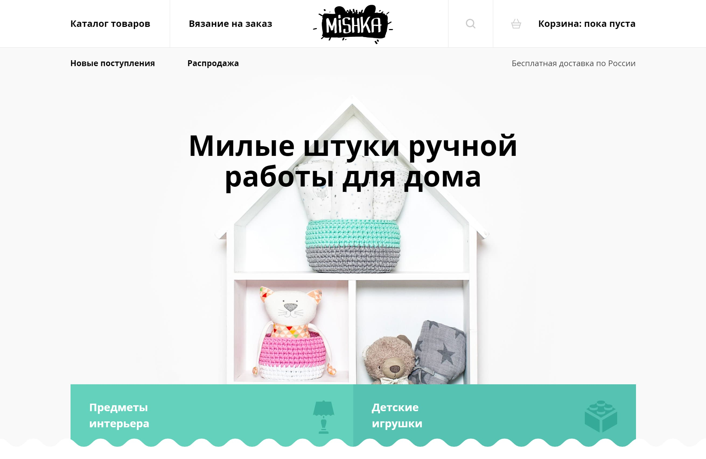

# Личный проект «Мишка» [![Build status][travis-image]][travis-url] [![Dependency status][dependency-image]][dependency-url]

* Студент: [Вячеслав Акулов](https://up.htmlacademy.ru/adaptive/16/user/909803).
* Наставник: [Евгений Ванчугов](https://htmlacademy.ru/profile/id94761).

---

---

Репозиторий создан для обучения на профессиональном онлайн‑курсе «[HTML и CSS, уровень 2](https://htmlacademy.ru/intensive/adaptive)» от [HTML Academy](https://htmlacademy.ru).

[travis-image]: https://travis-ci.com/htmlacademy-adaptive/909803-mishka-16.svg?branch=master
[travis-url]: https://travis-ci.com/htmlacademy-adaptive/909803-mishka-16
[dependency-image]: https://david-dm.org/htmlacademy-adaptive/909803-mishka-16/dev-status.svg?style=flat-square
[dependency-url]: https://david-dm.org/htmlacademy-adaptive/909803-mishka-16?type=dev
